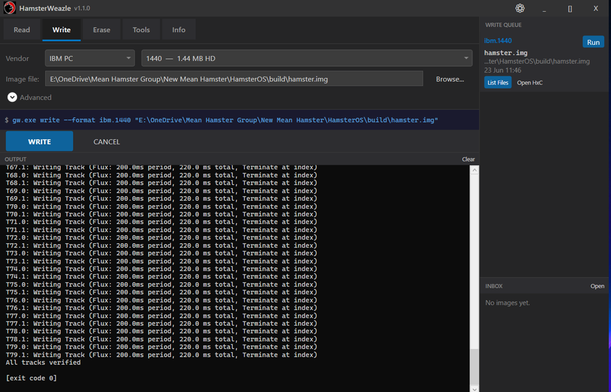

# HamsterWeazle

**HamsterWeazle** is a clean, modern Windows GUI for [GreaseWeazle](https://github.com/keirf/greaseweazle), built to make reading, writing, and managing floppy disk images easier.

GreaseWeazle is powerful, but working with floppy disks can involve multiple tools, command-line steps, firmware utilities, and separate disk-image viewers. HamsterWeazle brings the common workflow together in one easy-to-use place.

Built by **John Swiderski** / [Mean Hamster Software](https://meanhamster.com)

---

## Why HamsterWeazle?

The goal of HamsterWeazle is simple: make GreaseWeazle easier to use.

It brings together:

* A friendly Windows interface for common GreaseWeazle tasks
* Simple read and write workflows
* Automatic first-run setup
* Automatic updates for HamsterWeazle and related tools
* GreaseWeazle host tools access
* HxCFloppyEmulator integration for browsing disk image contents

Instead of jumping between separate programs and command-line utilities, HamsterWeazle gives you one place to read disks, write images, erase media, update tools, and inspect disk image contents.

---

## Installation

1. Download `HamsterWeazle.exe` from the [latest release](https://github.com/ziggystar12/HamsterWeazle/releases/latest)
2. Run it

That is all.

On first launch, HamsterWeazle automatically downloads and installs the GreaseWeazle host tools. It will also offer to download [HxCFloppyEmulator](https://github.com/jfdelnero/HxCFloppyEmulator) for browsing disk image contents.

HamsterWeazle can also keep itself, the GreaseWeazle tools, and HxCFloppyEmulator up to date automatically.

---

## What you need

* Windows 10/11 x64
* [.NET 10 Desktop Runtime](https://dotnet.microsoft.com/download/dotnet/10.0)
* A [GreaseWeazle](https://github.com/keirf/greaseweazle) USB adapter
* A compatible floppy drive

---

## What it does

GreaseWeazle reads and writes floppy disks at the raw magnetic flux level, supporting many vintage computer formats. HamsterWeazle puts a simple interface on top so you can get straight to working with disks.

* **Read** a physical floppy to an image file
* **Write** an image file back to a floppy
* **Erase** disks
* **Auto-detect** common disk image formats when writing
* **Update** GreaseWeazle device firmware
* **Run** drive cleaning tools from the Tools tab
* **Browse** disk image contents with HxCFloppyEmulator integration
* **Repeat** previous write jobs from the Write Queue
* **Archive** read images automatically in the Inbox folder

---

## Features

### Easy read and write workflow

HamsterWeazle is designed around the most common GreaseWeazle tasks: reading disks to image files and writing image files back to floppy disks.

The interface keeps the main workflow simple while still giving access to useful tools when you need them.

### Automatic setup and updates

HamsterWeazle can automatically download and manage:

* GreaseWeazle host tools
* HxCFloppyEmulator
* HamsterWeazle updates

This helps keep the pieces together without requiring manual setup every time.

### Format auto-detection

When writing, HamsterWeazle detects many common formats automatically from the file extension or image size.

| Extension / Size                 | Format detected                                       |
| -------------------------------- | ----------------------------------------------------- |
| `.adf`                           | Amiga AmigaDOS 880 KB or AmigaDOS HD                  |
| `.d64`                           | Commodore 1541                                        |
| `.d71`                           | Commodore 1571                                        |
| `.d81`                           | Commodore 1581                                        |
| `.st` / `.msa`                   | Atari ST 360 KB, 720 KB, or 1440 KB                   |
| `.img` / `.ima` / `.dsk` by size | IBM PC 160/180/320/360/720/800/1200/1440/1680/2880 KB |
| 901,120 bytes                    | Amiga AmigaDOS DD                                     |

### Disk image browsing

HamsterWeazle integrates with HxCFloppyEmulator so you can browse supported disk image contents without leaving the app.

You can list files and open disk images directly in the HxCFloppyEmulator GUI.

### Write Queue

The Write Queue remembers previous write jobs so you can repeat them later with one click.

### Inbox

The Inbox folder archives disks you read, helping keep captured disk images organized.

### Themes

HamsterWeazle includes multiple themes, including:

* Dark
* Amiga Workbench

Themes can be changed from `Settings > Theme`.

### Session restore

HamsterWeazle restores your previous session so you can pick up where you left off.

---

## Supported formats

HamsterWeazle supports the formats available through GreaseWeazle, including many systems such as:

* Amiga
* IBM PC
* Apple II
* Atari 8-bit
* Atari ST
* Commodore
* Macintosh
* MSX
* ZX Spectrum
* Sega
* Acorn
* DEC

And many more.

---

## Third-party software

HamsterWeazle works with and can automatically manage the following third-party tools:

* [GreaseWeazle host tools](https://github.com/keirf/greaseweazle) by Keir Fraser
* [HxCFloppyEmulator](https://github.com/jfdelnero/HxCFloppyEmulator) by Jean-Francois Del Nero

These tools remain the property of their respective authors and are governed by their own licenses.

HamsterWeazle provides a Windows interface and integration layer to make using them easier.

---

## License

Copyright (c) 2026 Mean Hamster Software - John Swiderski. All rights reserved.

HamsterWeazle is free to download and use for personal and non-commercial purposes.

Modification and redistribution are not permitted without written permission from the copyright holder.

---

## Disclaimer

HamsterWeazle interfaces indirectly with floppy disk hardware via GreaseWeazle at the raw magnetic flux level. While every effort has been made to make it safe and reliable, the authors accept no responsibility for data loss, damaged media, hardware faults, or any other issues that may arise from its use.

Always keep backup copies of disk images you care about. Floppy disks are fragile, and decades-old media may be unreliable regardless of the software used.

This software is provided as-is, without warranty of any kind.
